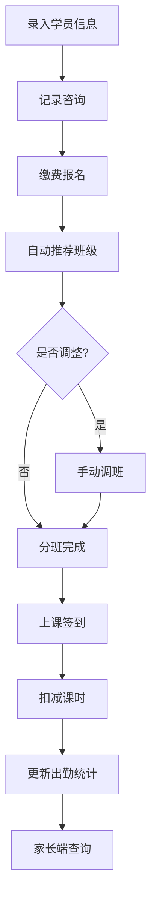

## 1. 产品概述

培训机构学员报名与分班管理系统，实现学员从咨询、报名、分班到上课签到的全流程管理。系统支持课程顾问、教师、家长三种角色，提供自动分班推荐、课时管理、出勤统计等核心功能。

- 目标用户：培训机构的课程顾问、授课教师、学员家长
- 核心价值：提升招生管理效率，实现学员全生命周期管理，透明化学员学习进度

## 2. 核心功能

### 2.1 用户角色

| 角色 | 登录方式 | 核心权限 |
|------|----------|----------|
| 课程顾问 | 账号密码登录 | 录入学员信息、记录咨询、办理报名、查看班级信息、手动调整分班 |
| 教师 | 账号密码登录 | 查看所带班级、上课签到、查看出勤记录 |
| 家长 | 手机号登录 | 查看剩余课时、查看上课记录 |
| 系统管理员 | 账号密码登录 | 班级管理、课程设置、统计报表、用户管理 |

### 2.2 功能模块

1. **学员管理**：学员信息录入、咨询记录管理、学员报名缴费
2. **班级管理**：班级预设（人数上限、年龄段、上课时间）、自动分班推荐、手动调整分班、班级人数查看
3. **考勤管理**：教师签到、出勤记录、出勤统计
4. **课时管理**：总课时设置、课时消耗计算、剩余课时查询、课程有效期、逾期冻结
5. **统计报表**：班级学员名单、出勤统计表
6. **家长端**：剩余课时查询、上课记录查看

### 2.3 页面详情

| 页面名称 | 模块名称 | 功能描述 |
|---------|----------|----------|
| 登录页 | 身份认证 | 角色选择、账号/手机号登录、密码重置 |
| 顾问首页 | 数据概览 | 今日咨询人数、待分班学员、近期报名统计 |
| 学员信息录入 | 学员管理 | 姓名、年龄、家长联系方式、意向课程录入 |
| 咨询记录 | 学员管理 | 记录每次咨询内容、跟进状态 |
| 报名缴费 | 学员管理 | 选择课程、设置总课时、缴费确认 |
| 班级列表 | 班级管理 | 查看所有班级、当前人数、学员名单 |
| 自动分班 | 班级管理 | 根据年龄和意向课程推荐班级、一键分配 |
| 手动调班 | 班级管理 | 拖拽调整学员所属班级、冲突检测 |
| 教师首页 | 考勤管理 | 今日课程列表、快速签到入口 |
| 上课签到 | 考勤管理 | 勾选出勤学员、批量签到、请假记录 |
| 出勤统计 | 考勤管理 | 按班级/学员统计出勤次数 |
| 班级设置 | 系统管理 | 新增/编辑班级、设置人数上限、年龄段、上课时间 |
| 课程设置 | 系统管理 | 课程名称、课时数、有效期、价格设置 |
| 统计报表 | 数据统计 | 班级学员名单导出、出勤统计表导出 |
| 家长首页 | 家长端 | 剩余课时展示、最近上课记录 |
| 上课记录 | 家长端 | 历史上课记录列表、出勤状态 |

## 3. 核心流程

### 学员报名流程
课程顾问录入学员基本信息 → 记录咨询跟进情况 → 学员确定报名 → 选择课程并缴费 → 系统根据年龄和意向课程自动推荐班级 → 确认分班或手动调整 → 分班完成

### 上课签到流程
教师登录系统 → 选择今日上课班级 → 勾选出勤学员 → 确认签到 → 系统自动扣减课时 → 更新出勤统计

### 家长查询流程
家长使用手机号登录 → 查看绑定学员信息 → 查看剩余课时 → 查看历史上课记录

## 4. 用户界面设计

### 4.1 设计风格
- **主色调**：教育蓝 (#2563eb)，代表专业与信任
- **辅助色**：活力橙 (#f97316)，用于关键操作按钮
- **成功色**：翠绿色 (#10b981)，出勤/正常状态
- **警告色**：琥珀色 (#f59e0b)，逾期/警告状态
- **中性色**：石板灰系列，用于文字和背景
- **按钮风格**：圆角 8px，带有微妙阴影，hover 时轻微上浮
- **字体**：使用 Noto Sans SC 作为中文字体，搭配 Inter 作为数字字体
- **布局风格**：卡片式布局，顶部导航 + 左侧菜单 + 内容区域
- **图标风格**：使用 lucide-react 线性图标，统一 20px 尺寸

### 4.2 页面设计概述

| 页面名称 | 模块名称 | UI 元素 |
|---------|----------|---------|
| 登录页 | 身份认证 | 渐变背景、卡片式登录框、角色切换标签、表单动效 |
| 顾问首页 | 数据概览 | 统计卡片网格、趋势图表、快捷操作区 |
| 学员列表 | 学员管理 | 表格展示、搜索过滤、状态标签、操作按钮 |
| 班级列表 | 班级管理 | 卡片式班级展示、人数进度条、学员数量徽章 |
| 签到页面 | 考勤管理 | 学员头像列表、勾选复选框、批量操作、时间选择 |
| 家长首页 | 家长端 | 大字号剩余课时、进度环、最近课程时间线 |

### 4.3 响应式
- 桌面端优先设计，默认 1280px 以上最佳体验
- 平板端 (768px-1279px)：侧边栏可收起，表格横向滚动
- 移动端 (<768px)：底部导航栏，卡片式列表展示

### 4.4 交互动效
- 页面加载：元素渐入 + 轻微上移动画
- 按钮交互：hover 时背景色加深 + 轻微上浮
- 表单验证：错误提示抖动动画
- 数据更新：数字滚动动画
- 模态框：缩放 + 淡入效果
