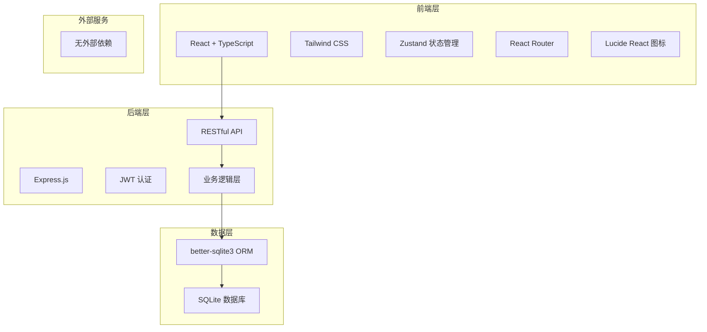
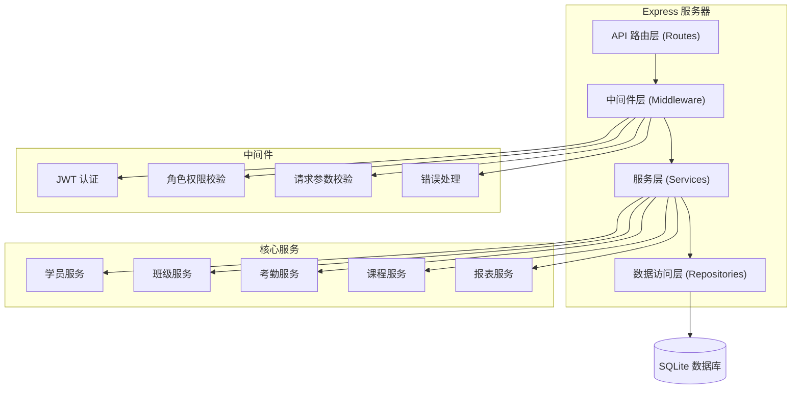

## 1. 架构设计



## 2. 技术描述

- **前端**：React@18 + TypeScript + Vite + TailwindCSS@3 + Zustand + React Router@6 + Lucide React
- **初始化工具**：vite-init (react-express-ts 模板)
- **后端**：Express@4 + TypeScript + JWT 认证
- **数据库**：SQLite + better-sqlite3
- **包管理器**：npm

## 3. 路由定义

### 前端路由

| 路由 | 角色 | 页面组件 | 功能 |
|------|------|----------|------|
| `/login` | 所有 | Login | 登录页面 |
| `/consultant` | 顾问 | ConsultantDashboard | 顾问首页 |
| `/consultant/students` | 顾问 | StudentList | 学员列表 |
| `/consultant/students/new` | 顾问 | StudentForm | 新增学员 |
| `/consultant/students/:id` | 顾问 | StudentDetail | 学员详情（咨询记录、报名） |
| `/consultant/classes` | 顾问 | ClassList | 班级列表 |
| `/consultant/classes/:id` | 顾问 | ClassDetail | 班级详情（学员名单、手动调班） |
| `/consultant/auto-assign` | 顾问 | AutoAssign | 自动分班 |
| `/teacher` | 教师 | TeacherDashboard | 教师首页 |
| `/teacher/attendance/:classId` | 教师 | AttendanceForm | 上课签到 |
| `/teacher/statistics` | 教师 | AttendanceStatistics | 出勤统计 |
| `/parent` | 家长 | ParentDashboard | 家长首页 |
| `/parent/records` | 家长 | ParentRecords | 上课记录 |
| `/admin` | 管理员 | AdminDashboard | 管理员首页 |
| `/admin/classes` | 管理员 | ClassManagement | 班级设置 |
| `/admin/courses` | 管理员 | CourseManagement | 课程设置 |
| `/admin/reports` | 管理员 | Reports | 统计报表 |
| `/admin/users` | 管理员 | UserManagement | 用户管理 |

### 后端 API 路由

| 方法 | 路由 | 功能 |
|------|------|------|
| POST | `/api/auth/login` | 用户登录 |
| GET | `/api/students` | 获取学员列表 |
| POST | `/api/students` | 新增学员 |
| GET | `/api/students/:id` | 获取学员详情 |
| PUT | `/api/students/:id` | 更新学员信息 |
| GET | `/api/students/:id/consultations` | 获取学员咨询记录 |
| POST | `/api/students/:id/consultations` | 新增咨询记录 |
| POST | `/api/students/:id/enroll` | 学员报名缴费 |
| GET | `/api/classes` | 获取班级列表 |
| POST | `/api/classes` | 新增班级 |
| GET | `/api/classes/:id` | 获取班级详情 |
| PUT | `/api/classes/:id` | 更新班级信息 |
| GET | `/api/classes/:id/students` | 获取班级学员列表 |
| POST | `/api/classes/auto-assign` | 自动分班推荐 |
| POST | `/api/classes/:id/assign-student` | 分配学员到班级 |
| POST | `/api/classes/:id/remove-student` | 从班级移除学员 |
| GET | `/api/courses` | 获取课程列表 |
| POST | `/api/courses` | 新增课程 |
| PUT | `/api/courses/:id` | 更新课程 |
| POST | `/api/attendance` | 提交签到记录 |
| GET | `/api/attendance/class/:classId` | 获取班级出勤记录 |
| GET | `/api/attendance/student/:studentId` | 获取学员出勤记录 |
| GET | `/api/reports/class-roster/:classId` | 班级学员名单 |
| GET | `/api/reports/attendance/:classId` | 出勤统计表 |
| GET | `/api/parent/remaining-hours` | 家长查询剩余课时 |
| GET | `/api/parent/attendance-records` | 家长查询上课记录 |

## 4. API 类型定义

```typescript
// 基础类型
interface User {
  id: number;
  username: string;
  role: 'consultant' | 'teacher' | 'parent' | 'admin';
  name: string;
  phone: string;
  createdAt: string;
}

interface Student {
  id: number;
  name: string;
  age: number;
  parentPhone: string;
  intendedCourseId: number | null;
  status: 'consulting' | 'enrolled' | 'suspended';
  classId: number | null;
  createdAt: string;
}

interface ConsultationRecord {
  id: number;
  studentId: number;
  content: string;
  consultantId: number;
  followUpStatus: 'pending' | 'contacted' | 'enrolled' | 'lost';
  createdAt: string;
}

interface Course {
  id: number;
  name: string;
  totalHours: number;
  price: number;
  validityDays: number;
  description: string;
  createdAt: string;
}

interface Class {
  id: number;
  name: string;
  courseId: number;
  maxStudents: number;
  minAge: number;
  maxAge: number;
  schedule: string;
  teacherId: number | null;
  status: 'active' | 'full' | 'completed';
  createdAt: string;
}

interface Enrollment {
  id: number;
  studentId: number;
  courseId: number;
  totalHours: number;
  remainingHours: number;
  paidAmount: number;
  enrollDate: string;
  expireDate: string;
  isFrozen: boolean;
  createdAt: string;
}

interface AttendanceRecord {
  id: number;
  classId: number;
  studentId: number;
  attendanceDate: string;
  status: 'present' | 'absent' | 'leave';
  createdAt: string;
}

// 请求类型
interface LoginRequest {
  role: string;
  username?: string;
  phone?: string;
  password: string;
}

interface CreateStudentRequest {
  name: string;
  age: number;
  parentPhone: string;
  intendedCourseId?: number;
}

interface EnrollRequest {
  courseId: number;
  totalHours: number;
  paidAmount: number;
}

interface CreateClassRequest {
  name: string;
  courseId: number;
  maxStudents: number;
  minAge: number;
  maxAge: number;
  schedule: string;
  teacherId?: number;
}

interface AttendanceSubmitRequest {
  classId: number;
  attendanceDate: string;
  records: {
    studentId: number;
    status: 'present' | 'absent' | 'leave';
  }[];
}

// 响应类型
interface ApiResponse<T> {
  success: boolean;
  data?: T;
  message?: string;
}

interface ClassWithStats extends Class {
  currentStudents: number;
  teacherName?: string;
  courseName: string;
}

interface StudentWithDetails extends Student {
  intendedCourseName?: string;
  className?: string;
  enrollment?: Enrollment;
  attendanceCount: number;
}
```

## 5. 服务器架构图



## 6. 数据模型

### 6.1 ER 图

```mermaid
erDiagram
    USER ||--o{ CONSULTATION_RECORD : creates
    USER ||--o{ CLASS : teaches
    STUDENT ||--o{ CONSULTATION_RECORD : has
    STUDENT ||--o| ENROLLMENT : has
    STUDENT }o--|| CLASS : assigned_to
    STUDENT ||--o{ ATTENDANCE_RECORD : has
    COURSE ||--o{ CLASS : offers
    COURSE ||--o{ ENROLLMENT : "enrolled in"
    CLASS ||--o{ ATTENDANCE_RECORD : has
    
    USER {
        int id PK
        string username
        string password_hash
        string role
        string name
        string phone
        datetime created_at
    }
    
    STUDENT {
        int id PK
        string name
        int age
        string parent_phone
        int intended_course_id FK
        string status
        int class_id FK
        datetime created_at
    }
    
    CONSULTATION_RECORD {
        int id PK
        int student_id FK
        text content
        int consultant_id FK
        string follow_up_status
        datetime created_at
    }
    
    COURSE {
        int id PK
        string name
        int total_hours
        decimal price
        int validity_days
        text description
        datetime created_at
    }
    
    CLASS {
        int id PK
        string name
        int course_id FK
        int max_students
        int min_age
        int max_age
        string schedule
        int teacher_id FK
        string status
        datetime created_at
    }
    
    ENROLLMENT {
        int id PK
        int student_id FK
        int course_id FK
        int total_hours
        int remaining_hours
        decimal paid_amount
        date enroll_date
        date expire_date
        boolean is_frozen
        datetime created_at
    }
    
    ATTENDANCE_RECORD {
        int id PK
        int class_id FK
        int student_id FK
        date attendance_date
        string status
        datetime created_at
    }
```

### 6.2 DDL 语句

```sql
-- 用户表
CREATE TABLE users (
  id INTEGER PRIMARY KEY AUTOINCREMENT,
  username VARCHAR(50) UNIQUE,
  password_hash VARCHAR(255) NOT NULL,
  role VARCHAR(20) NOT NULL CHECK (role IN ('consultant', 'teacher', 'parent', 'admin')),
  name VARCHAR(100) NOT NULL,
  phone VARCHAR(20),
  created_at DATETIME DEFAULT CURRENT_TIMESTAMP
);

-- 学员表
CREATE TABLE students (
  id INTEGER PRIMARY KEY AUTOINCREMENT,
  name VARCHAR(100) NOT NULL,
  age INTEGER NOT NULL,
  parent_phone VARCHAR(20) NOT NULL,
  intended_course_id INTEGER,
  status VARCHAR(20) NOT NULL DEFAULT 'consulting' CHECK (status IN ('consulting', 'enrolled', 'suspended')),
  class_id INTEGER,
  created_at DATETIME DEFAULT CURRENT_TIMESTAMP,
  FOREIGN KEY (intended_course_id) REFERENCES courses(id),
  FOREIGN KEY (class_id) REFERENCES classes(id)
);

-- 咨询记录表
CREATE TABLE consultation_records (
  id INTEGER PRIMARY KEY AUTOINCREMENT,
  student_id INTEGER NOT NULL,
  content TEXT NOT NULL,
  consultant_id INTEGER NOT NULL,
  follow_up_status VARCHAR(20) NOT NULL DEFAULT 'pending' CHECK (follow_up_status IN ('pending', 'contacted', 'enrolled', 'lost')),
  created_at DATETIME DEFAULT CURRENT_TIMESTAMP,
  FOREIGN KEY (student_id) REFERENCES students(id),
  FOREIGN KEY (consultant_id) REFERENCES users(id)
);

-- 课程表
CREATE TABLE courses (
  id INTEGER PRIMARY KEY AUTOINCREMENT,
  name VARCHAR(100) NOT NULL,
  total_hours INTEGER NOT NULL,
  price DECIMAL(10,2) NOT NULL,
  validity_days INTEGER NOT NULL,
  description TEXT,
  created_at DATETIME DEFAULT CURRENT_TIMESTAMP
);

-- 班级表
CREATE TABLE classes (
  id INTEGER PRIMARY KEY AUTOINCREMENT,
  name VARCHAR(100) NOT NULL,
  course_id INTEGER NOT NULL,
  max_students INTEGER NOT NULL,
  min_age INTEGER NOT NULL,
  max_age INTEGER NOT NULL,
  schedule VARCHAR(200) NOT NULL,
  teacher_id INTEGER,
  status VARCHAR(20) NOT NULL DEFAULT 'active' CHECK (status IN ('active', 'full', 'completed')),
  created_at DATETIME DEFAULT CURRENT_TIMESTAMP,
  FOREIGN KEY (course_id) REFERENCES courses(id),
  FOREIGN KEY (teacher_id) REFERENCES users(id)
);

-- 报名表
CREATE TABLE enrollments (
  id INTEGER PRIMARY KEY AUTOINCREMENT,
  student_id INTEGER NOT NULL,
  course_id INTEGER NOT NULL,
  total_hours INTEGER NOT NULL,
  remaining_hours INTEGER NOT NULL,
  paid_amount DECIMAL(10,2) NOT NULL,
  enroll_date DATE NOT NULL,
  expire_date DATE NOT NULL,
  is_frozen BOOLEAN NOT NULL DEFAULT 0,
  created_at DATETIME DEFAULT CURRENT_TIMESTAMP,
  FOREIGN KEY (student_id) REFERENCES students(id),
  FOREIGN KEY (course_id) REFERENCES courses(id),
  UNIQUE(student_id, course_id)
);

-- 出勤记录表
CREATE TABLE attendance_records (
  id INTEGER PRIMARY KEY AUTOINCREMENT,
  class_id INTEGER NOT NULL,
  student_id INTEGER NOT NULL,
  attendance_date DATE NOT NULL,
  status VARCHAR(20) NOT NULL CHECK (status IN ('present', 'absent', 'leave')),
  created_at DATETIME DEFAULT CURRENT_TIMESTAMP,
  FOREIGN KEY (class_id) REFERENCES classes(id),
  FOREIGN KEY (student_id) REFERENCES students(id),
  UNIQUE(class_id, student_id, attendance_date)
);

-- 索引
CREATE INDEX idx_students_status ON students(status);
CREATE INDEX idx_students_class_id ON students(class_id);
CREATE INDEX idx_classes_course_id ON classes(course_id);
CREATE INDEX idx_classes_status ON classes(status);
CREATE INDEX idx_attendance_class_date ON attendance_records(class_id, attendance_date);
CREATE INDEX idx_attendance_student ON attendance_records(student_id);
CREATE INDEX idx_enrollments_student ON enrollments(student_id);
CREATE INDEX idx_enrollments_expire ON enrollments(expire_date, is_frozen);

-- 初始数据
INSERT INTO users (username, password_hash, role, name, phone) VALUES 
('admin', '$2b$10$default_hash', 'admin', '系统管理员', '13800000000'),
('consultant1', '$2b$10$default_hash', 'consultant', '张老师', '13800000001'),
('teacher1', '$2b$10$default_hash', 'teacher', '李老师', '13800000002');

INSERT INTO courses (name, total_hours, price, validity_days, description) VALUES
('英语启蒙班', 48, 4800, 180, '适合4-6岁儿童的英语启蒙课程'),
('数学思维班', 36, 3600, 120, '培养数学逻辑思维能力'),
('创意绘画班', 24, 2400, 90, '激发创造力的绘画课程');

INSERT INTO classes (name, course_id, max_students, min_age, max_age, schedule, teacher_id, status) VALUES
('英语启蒙A班', 1, 12, 4, 6, '每周一、三 16:00-17:30', 3, 'active'),
('英语启蒙B班', 1, 12, 5, 7, '每周二、四 16:00-17:30', 3, 'active'),
('数学思维A班', 2, 15, 6, 8, '每周六 09:00-11:00', NULL, 'active');
```
